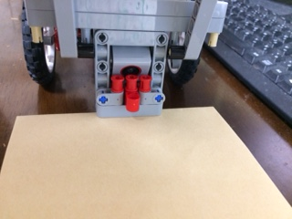
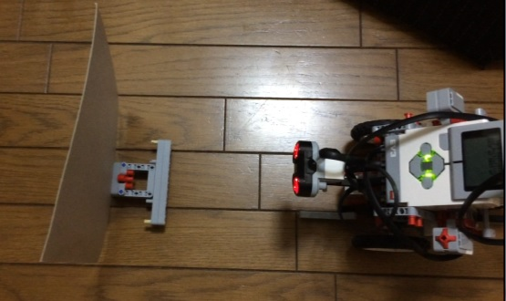
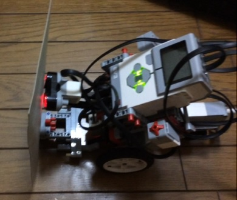
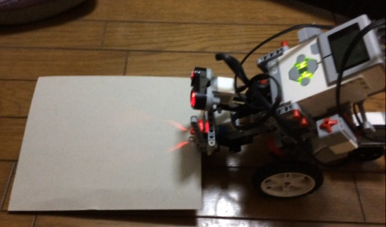
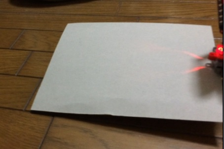

# 報告 #674
## 懸賞をアームで抱えたときにカラーセンサーが色を測定可能か
不可能

懸賞を持った時に、EV3はカラーセンサーで床を捉える事は出来なかった。

EV3のアームで、懸賞付きのパーツ(以降、パーツと記載する)を持つと、カラーセンサーのすぐ近くにパーツが位置する。  
また、隙間の先には懸賞が構えていますので床を捉えることは到底無理だと思います。

## 検討した懸賞運びの別案
* 尻尾で引っ掛けて持ち上げる : 不可能
  * EV3をパーツに横づけする際に、尻尾の車輪型のパーツが接触する為、懸賞が倒れる恐れがある
  * 電源OFFの状態で、尻尾を動かして懸賞運びパーツを持てるか試したが、引っ掛けられそうにない
  * 引っ掛ける事が出来たら、安定して持ち上げる事が出来る
* 超音波センサーの向きによる違い : 無し
  * 超音波センサーを正面と下向きの両方で、アームによる持ち上げ方に差異が無いかを検討したが、違いは無かった

# 懸賞を持ってからゴールするまでの方法提案
* 自己位置推定で、ゴール座標まで移動
* 懸賞を持ち上げた位置から、ゴールまでの相対座標へ移動する固定動作
* (その他)

# 画像
* 対峙
* アーム差し込み
* 持ち上げ
* 厚紙と床の隙間