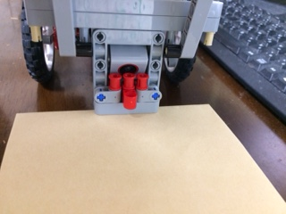

# 報告 #674
## 懸賞をアームで抱えたときにカラーセンサーが色を測定可能か
懸賞を持ったとき、カラーセンサーは床を捉えることはできませんでした。

動かしていませんが、懸賞付きのパーツを持つとカラーセンサーの目の前にパーツが来ます。
また、隙間の先には懸賞が構えていますので床を捉えることは到底無理だと思います。

## 検討した懸賞運びの別案
* 尻尾で引っ掛けて持ち上げる  
電源OFFで、手で尻尾を動かして懸賞運びパーツを持てないか試しましたが、引っ掛けられそうにありません。
引っ掛けられれば、持ち上がって安定します。
* 超音波センサーの向きによる違い  
「正面向き」「下向き」で、アームによる持ち上げ方に差異がないか検討しましたが、特に変わりありませんでした。

# 懸賞を持ってからゴールするまでの方法提案
* 自己位置推定で、ゴール座標まで移動
* 懸賞を持ち上げた位置から、ゴールまでの相対座標へ移動する固定動作
* (その他)
